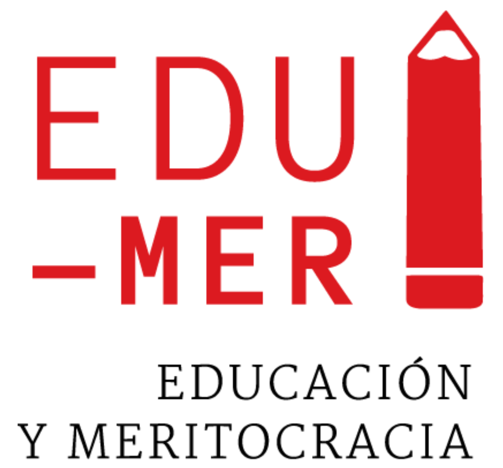

---
format:
  html:
    toc: true
    css: justify.css
---

{.float-end fig-align="right" width="160"}

# Presentación {.unnumbered}

La Encuesta Panel Educación y Meritocracia (EDUMER) es un estudio diseñado para analizar la relación entre aspectos morales del mercado educativo y diversas actitudes y comportamientos ligados a la formación ciudadana en estudiantes de ciclo básico y enseñanza media ( 6.º/7.º básico y 1.º/2.º medio) en Chile a lo largo del tiempo. Este proyecto examina las percepciones y valores sobre elementos característicos del mercado educativo, como la competencia, la selección y el mérito, para analizar sus implicancias individuales y contextuales en la formación ciudadana durante la etapa escolar. Su objetivo principal es proporcionar datos empíricos para comprender la conformación temprana de creencias sobre la meritocracia en la sociedad y en la escuela, y cómo sus cambios en el tiempo se relacionan con comportamientos y valores políticos y sociales.

La encuesta fue diseñada por investigadores del proyecto Educación y Meritocracia (EDUMER), dirigido por Juan Carlos Castillo, profesor asociado del Departamento de Sociología de la Universidad de Chile (FACSO-UCH) e investigador asociado al Centro de Estudios del Conflicto y Cohesión Social (COES). Este proyecto ha sido financiado por el Fondecyt N.º 1210847 “Meritocracia en la escuela: fundamentos morales del mercado educativo y sus implicancias para la formación ciudadana en Chile” de la Agencia Nacional de Investigación y Desarrollo (ANID), dependiente del Ministerio de Ciencia, Tecnología, Conocimiento e Innovación de Chile. La recolección de datos de EDUMER ha sido licitada públicamente y adjudicada en todas sus mediciones a la Consultora Datavoz.

El proyecto inició formalmente en agosto de 2021, tras la aprobación del protocolo por parte del comité de ética el 28 de mayo de 2021. EDUMER está configurado como un estudio panel con dos olas de aplicación dirigidas a comunidades escolares de las regiones Metropolitana y de Valparaíso. La recolección de datos estuvo a cargo de Datavoz mediante la modalidad autoaplicada online (CAWI), implementada en las salas de computación de los establecimientos participantes en el caso de los estudiantes.

La Ola 1 recogió información de estudiantes, docentes y apoderados, alcanzando una muestra de 902 estudiantes, 180 apoderados y 26 docentes (vinculados a 781 estudiantes). El trabajo de campo de esta primera ola se desarrolló en dos momentos: entre octubre / diciembre de 2023, y entre abril / mayo de 2024, registrando respuestas efectivas de estudiantes entre el 11 de octubre de 2023 y el 3 de mayo de 2024, con una duración aproximada de 20 minutos por cuestionario.

Por su parte, la Ola 2 volvió a encuestar únicamente a estudiantes de las mismas regiones, logrando un total de 674 casos, de los cuales 639 corresponden a participantes vinculados secuencialmente con la Ola 1.